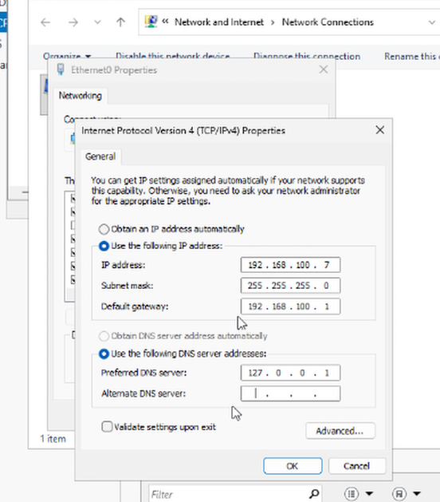
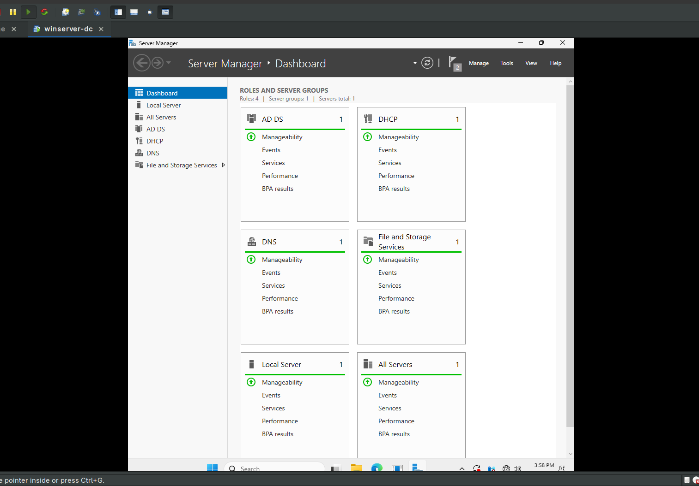
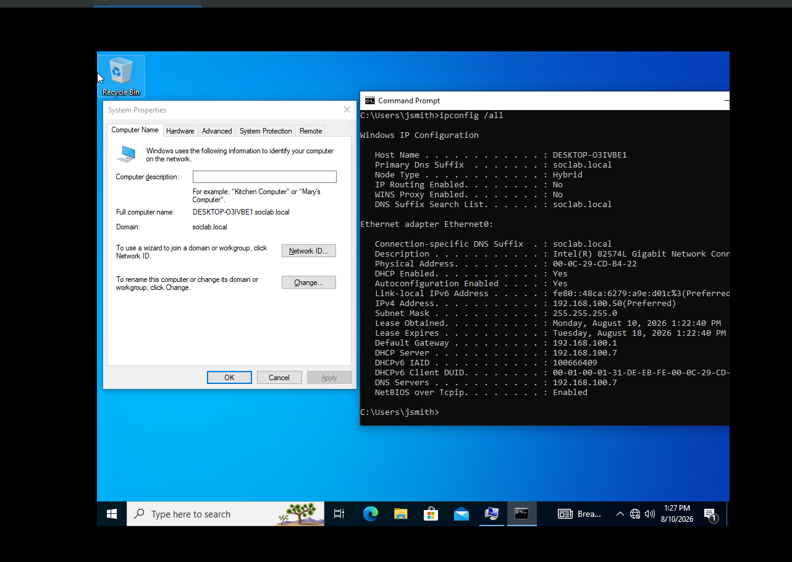

# Phase 1: Baseline Infrastructure Setup

This document covers the initial deployment of the core domain controller and domain membership.

## Environment Details

* **Operating System:** Windows Server 2025 (Desktop Experience)
* **Domain Controller Name:** `DC01`
* **Domain Name:** `soclab.local`
* **Static IP:** `192.168.100.7/24`
* **Preferred DNS:** `127.0.0.1 (192.168.100.7)`

---

## Deployment Summary

1. **Server Deployment:** Installed Windows Server 2025 VM with static IP configuration (`192.168.100.7`).
   
2. **AD DS Promotion:** Installed Active Directory Domain Services and DNS server roles. Promoted server as the root Domain Controller for `soclab.local`.
   
3. **Workstation Integration:** Installed Windows 10 Enterprise (`DESKTOP-O3IVBE1`), pointed preferred DNS to `192.168.100.7`, and joined the machine to the `soclab.local` domain.
   
---

## Verification

* Verified Active Directory Domain Services and DNS services are active on `DC01`.
* Confirmed `WKSTN01` is listed in the `Computers` container and reachable via domain logon.
