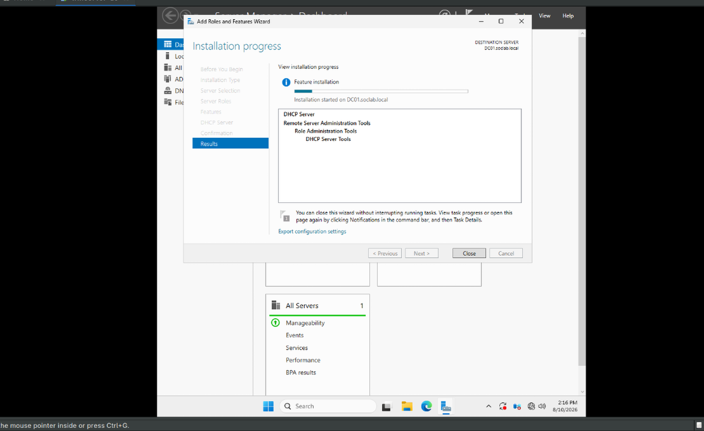
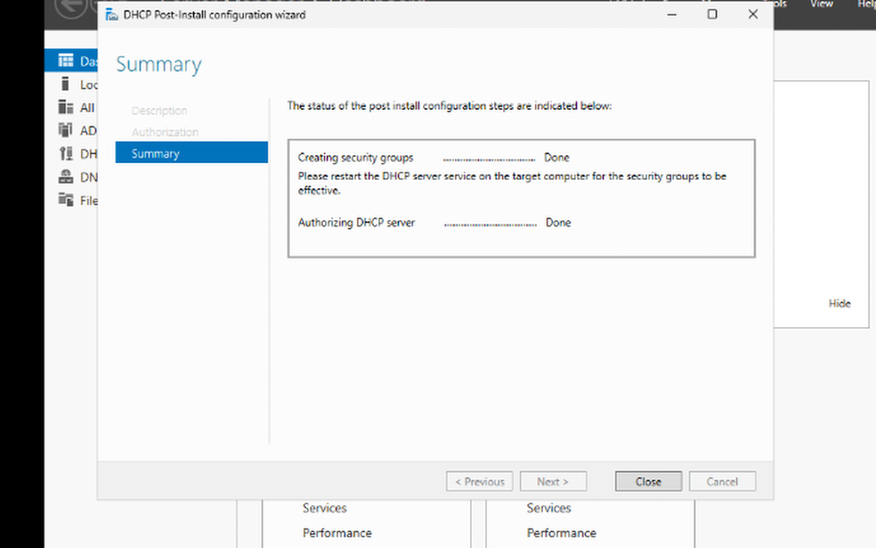
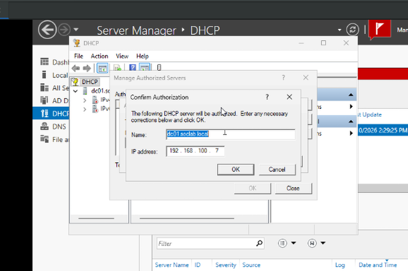
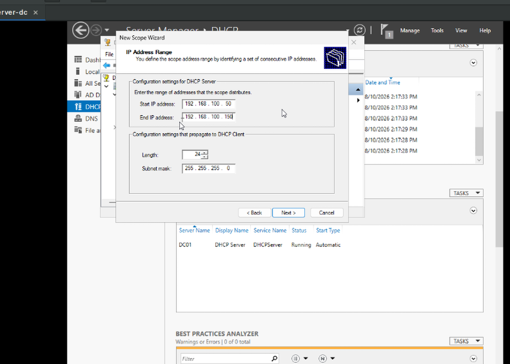
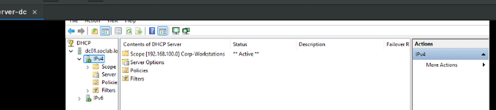
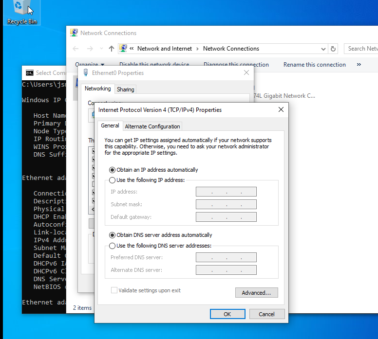
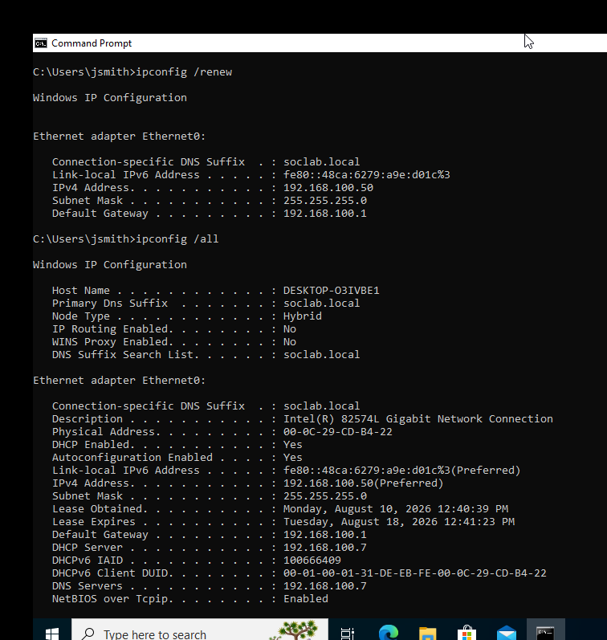

# Phase 2: DNS and DHCP Configuration
This document covers name resolution and dynamic IP addressing setup on `DC01`, including installation and authorization of the DHCP Server role and deployment of the `Corp-Workstations` scope.

## Environment Details

* **DNS Server:** `DC01` (`192.168.100.7`) — installed automatically during AD DS promotion in Phase 1
* **DHCP Server:** `DC01` (`192.168.100.7`)
* **Scope Name:** `Corp-Workstations`
* **Scope Range:** `192.168.100.50` – `192.168.100.150`
* **Subnet Mask:** `255.255.255.0`

---

## DNS Configuration

DNS was installed alongside Active Directory Domain Services during the Phase 1 promotion of `DC01` to domain controller. All domain-joined hosts point their preferred DNS server to `192.168.100.7`, allowing name resolution for `soclab.local` and enabling clients to locate the domain controller for authentication (SRV records, LDAP, Kerberos).

## DHCP Server Role Installation

1. **Role Installation:** Added the DHCP Server role to `DC01` via Server Manager.
 
   

2. **Post-Install Configuration:** Completed the DHCP post-deployment configuration wizard.
 
   

3. **Authorization in Active Directory:** Authorized the DHCP server in AD DS so it's permitted to lease addresses on the domain (unauthorized DHCP servers are ignored by domain-joined clients).
 
   

## Scope Configuration

1. **Scope Creation:** Created the `Corp-Workstations` scope with an address range of `192.168.100.50` – `192.168.100.150`, reserving `.1`–`.49` for infrastructure (DC, gateway, static hosts).

   

2. **Scope Activation:** Activated the scope to begin leasing addresses to clients on the `192.168.100.0/24` segment.

    

---

## Client Verification

1. **Adapter Configuration:** Set the `DESKTOP-O3IVBE1` network adapter to obtain an IP address automatically (DHCP) instead of a static assignment.

    

3. **Lease Confirmation:** Ran `ipconfig /release` and `ipconfig /renew` on `WKSTN01`, confirming it received a lease within the `Corp-Workstations` scope range and that the DNS server was correctly assigned as `192.168.100.7`.

    

---

## Verification

* Confirmed the DHCP role shows as **Authorized** in the DHCP console.
* Confirmed `DESKTOP-O3IVBE1` received a lease within the `192.168.100.50–150` range.
* Confirmed DNS resolution and domain connectivity persisted after switching from static to DHCP addressing.
