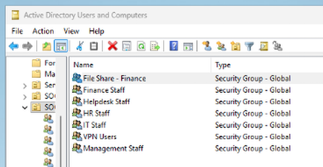
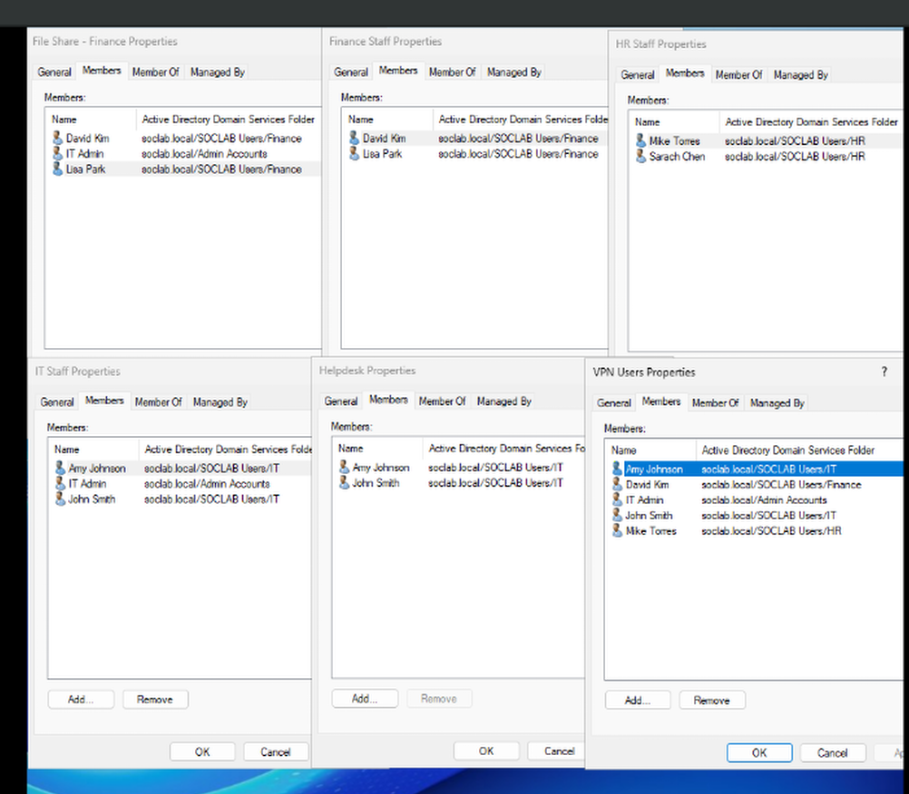
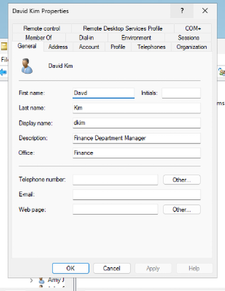

# Phase 3: Organizational Unit (OU) & RBAC Design

This section documents the Active Directory Organizational Unit structure, provisioned departmental accounts, and Role-Based Access Control (RBAC) security groups for `soclab.local`.

---

## Organizational Unit Structure

To move away from the default flat containers, a departmental OU structure was implemented under `soclab.local`:

```text
soclab.local
├── Admin Accounts
├── Domain Controllers
├── Service Accounts
├── SOCLAB Computers          (SOCLab - Restrict Local Admin GPO linked here)
├── SOCLAB Groups
└── SOCLAB Users
    ├── Finance
    ├── HR
    ├── IT
    └── Management
```


---

## Identity & Group Management

**Security groups (`SOCLAB Groups` OU):**
- `IT-Staff` — IT department personnel
- `Finance-Users` — Finance team members
- `HR-Users` — HR team members
- `HelpDesk-Admins` — delegated administration account(s) for day-to-day helpdesk tasks





---

## Provisioned Users

User accounts were generated across each department with standard attributes (First/Last Name, UPN, `Department` attribute) and assigned to their respective security group.



---

## Delegated Administration

`Help Desk Adminss` was granted delegated permissions to perform routine account tasks (password resets, unlocks) without full Domain Admin rights.

---

## Verification

* Confirmed OU tree matches the structure above via `dsa.msc`.
* Confirmed each security group contains the expected department members.
* Confirmed `HelpDesk-Admins` can perform delegated actions without Domain Admin membership.
