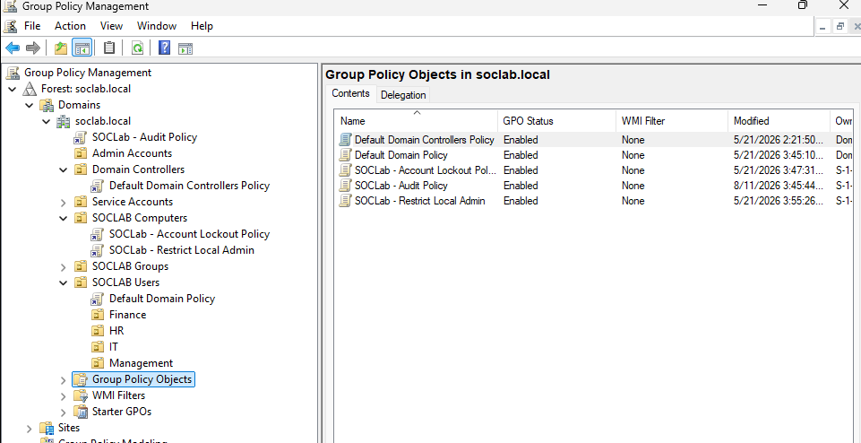
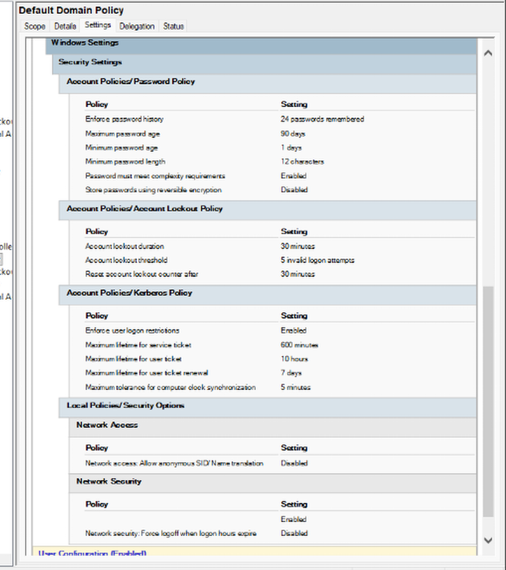
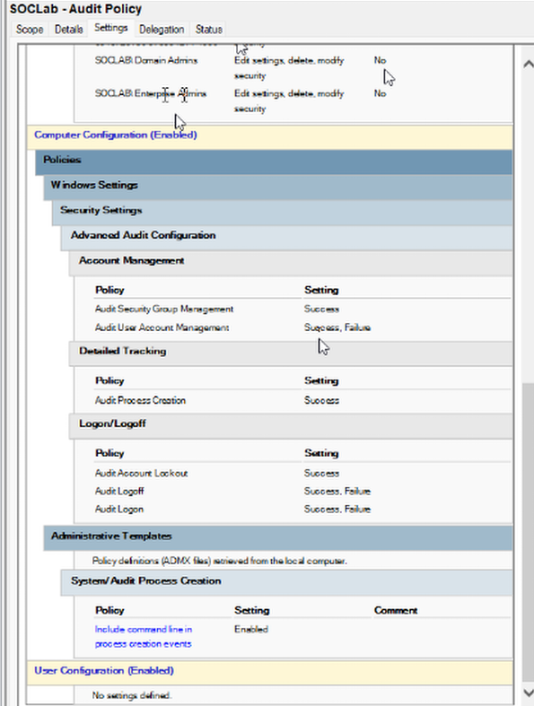
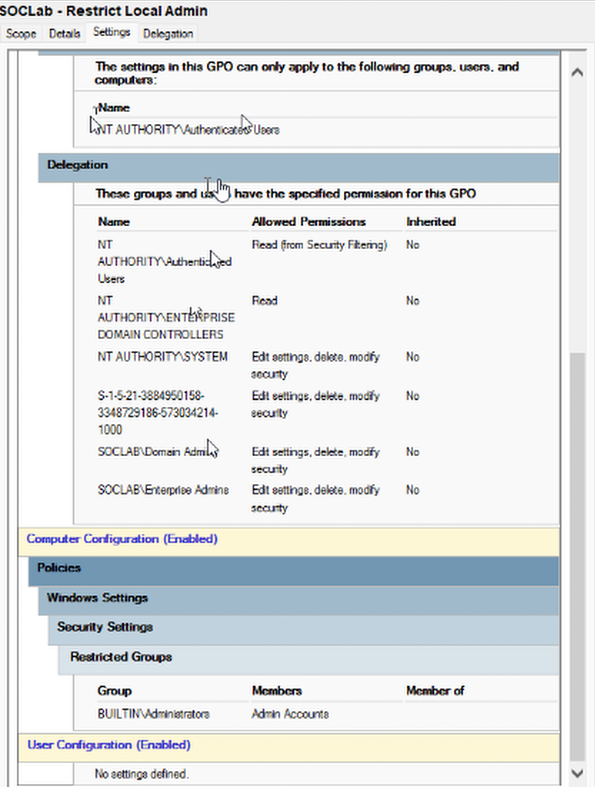
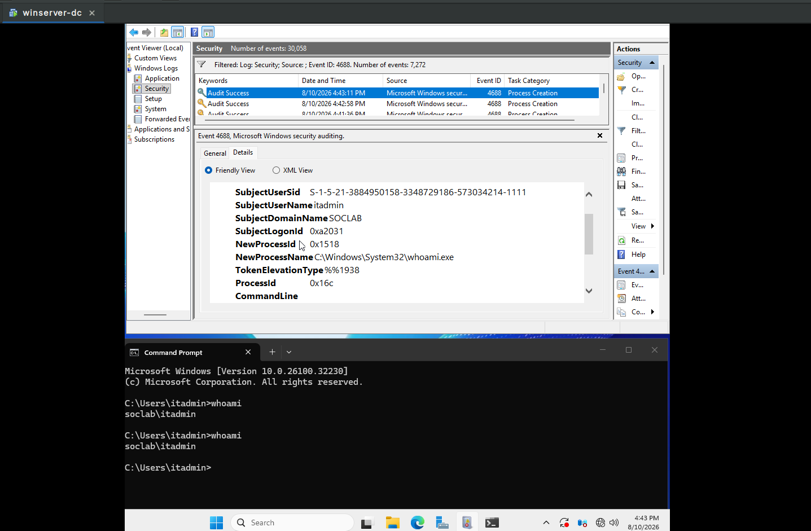

# Phase 4: Group Policy Management & Security Baseline

This section details the custom Group Policy Objects (GPOs) configured to enforce security baselines and advanced security auditing across `soclab.local`.

---

## Deployed GPOs

| GPO Name | Purpose | Linked To |
| :--- | :--- | :--- |
| `Default Domain Policy` | Baseline domain-wide password/account policy | Domain root |
| `Default Domain Controllers Policy` | Built-in DC security baseline | Domain Controllers OU |
| `SOCLab - Account Lockout Policy` | Enforces account lockout thresholds domain-wide | *(confirm link target)* |
| `SOCLab - Audit Policy` | Enables Advanced Audit Policy logging (Logon, Account Management, Process Creation) | *(confirm link target)* |
| `SOCLab - Restrict Local Admin` | Restricts local administrator rights on workstations | `SOCLAB Computers` OU |

---

## Applied Policy Settings

### 1. Default Domain Policy 
Enforces password length, complexity, and account lockout parameters across all user accounts.

### 2. Advanced Security Audit Policy
Configured via `Computer Configuration → Policies → Windows Settings → Security Settings → Advanced Audit Policy Configuration`:
* **Logon/Logoff:** Audit Logon (Success/Failure), Audit Account Lockout (Success)
* **Account Management:** Audit User Account Management (Success/Failure), Audit Security Group Management (Success)
* **Detailed Tracking:** Audit Process Creation (Success), plus *Include command line in process creation events* (Administrative Templates → System → Audit Process Creation)

### 3. Restrict Local Admin Rights
Removes standard domain users from the local Administrators group on domain-joined workstations, linked at the `SOCLAB Computers` OU.

---

## Verification & Event Generation

Auditing policies were validated on `DC01` by reviewing Event Viewer logs after running `whoami` from an admin session:

* **Event ID 4688:** Process Creation, confirmed with full command-line arguments captured (`whoami.exe` run by `SOCLAB\itadmin`).

