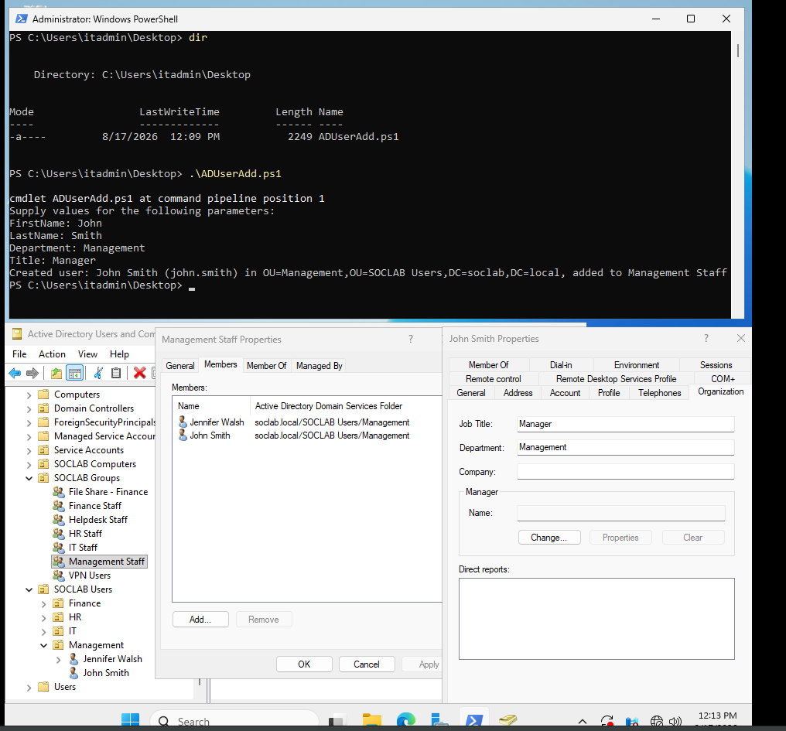
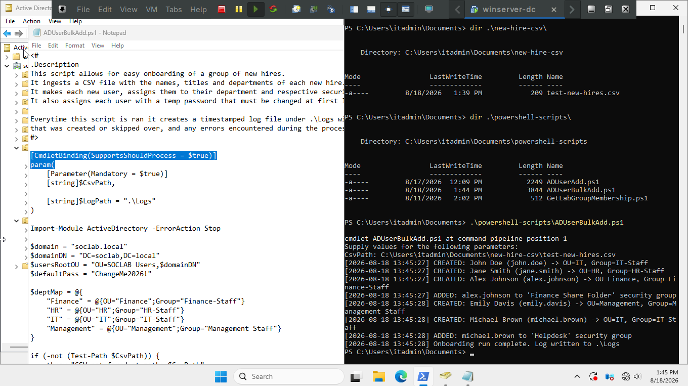
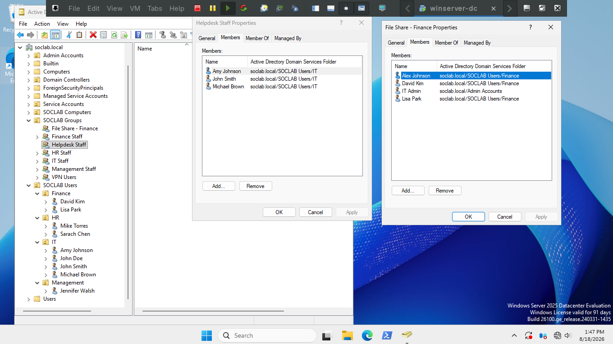
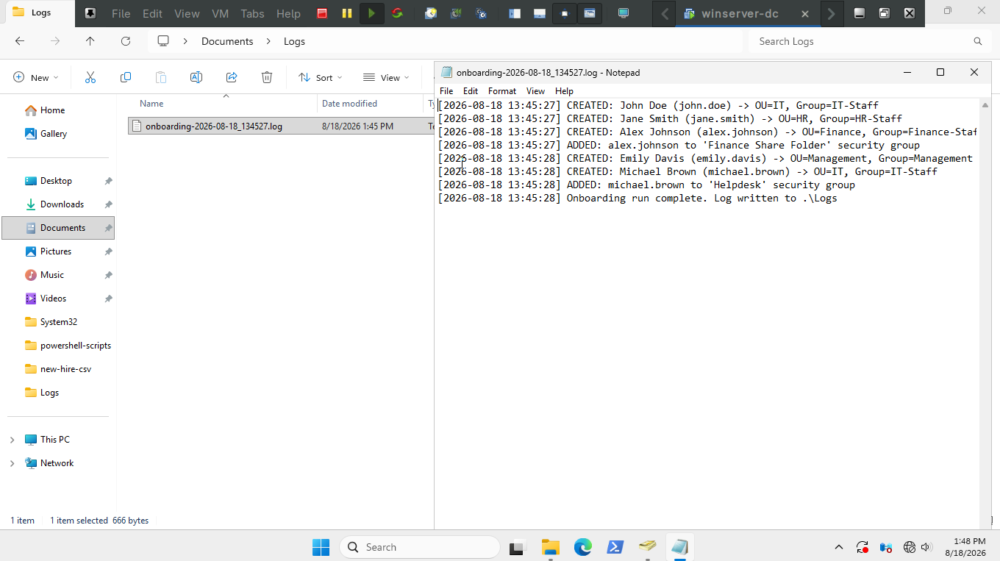
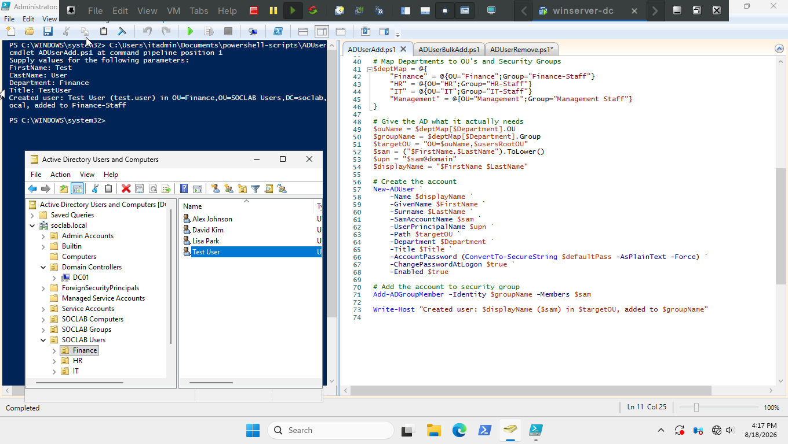
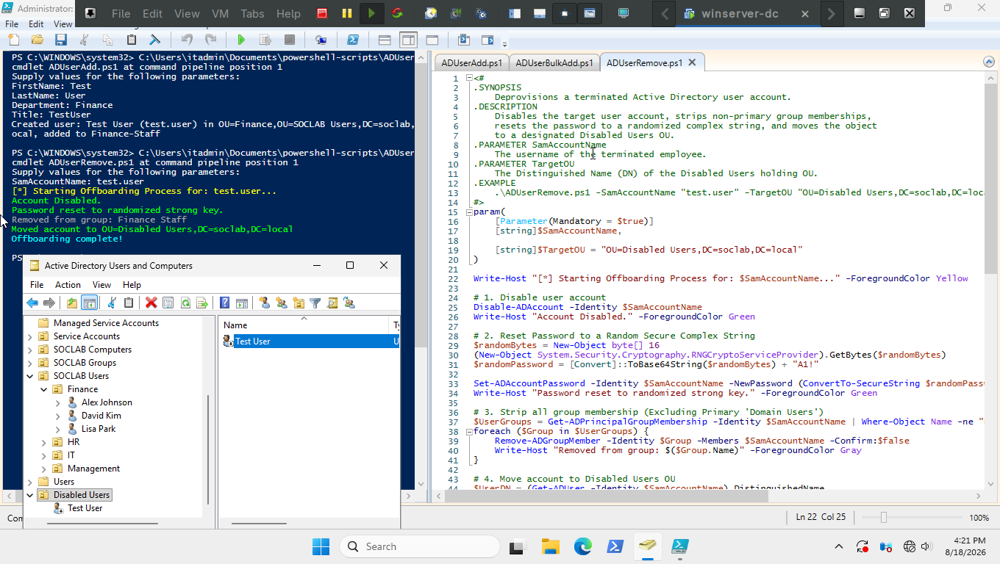
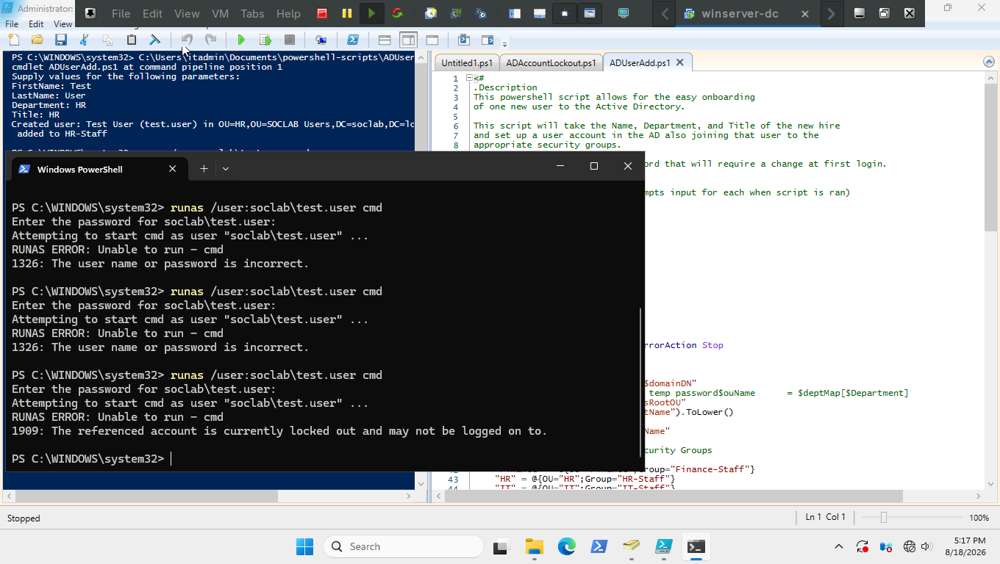
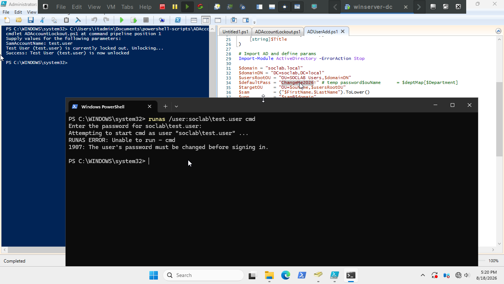
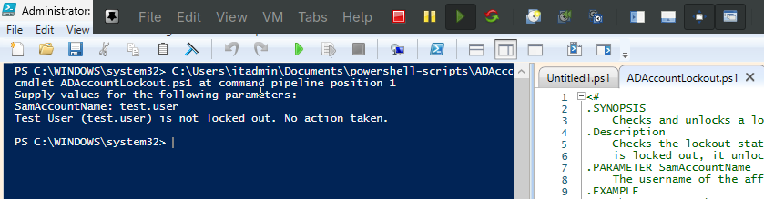

# Phase 5: PowerShell Administration & Automation

This section documents the PowerShell scripts built to automate routine Active Directory administration in `soclab.local`: 
onboarding, offboarding, and locked-account triage — the same tasks handled manually (and by hand-entered tickets) in earlier phases.

All scripts target the `ActiveDirectory` PowerShell module (RSAT) and are designed to run under a **`Helpdesk Staff`** account where possible, 
in line with the delegated administration model set up in [Phase 3](../03-ou-and-rbac-design/README.md).

---

## Scripts
| Script | Purpose | Requires Domain Admin? |
|---|---|---|
| [`ADUserAdd.ps1`](scripts/ADUserAdd.ps1) | Creates a single new hire account, creates temp pass, places them in the correct department ou, and adds them to the matching security group | Yes - eventually delegating to `Helpdesk Staff`|
| [`ADUserBulkAdd.ps1`](scripts/ADUserBulkAdd.ps1) | Ingests a CSV of new hires creates accounts, temp passes, places them in correct department ou and adds them to the matching security group | Yes - eventually delegating to `Helpdesk Staff` |
| [`ADUserRemove.ps1`](scripts/ADUserRemove.ps1) | Disables a terminated employee's account, strips all group membership, resets the password, and moves the object to a `Disabled Users` holding OU | Yes |
| `ADAccountLockout.ps1` - planned | 

---

## ADUserAdd.ps1

[`ADUserAdd.ps1`](scripts/ADUserAdd.ps1)

### How to run
Prompts for an input of first name, last name, department, and job title.

```powershell
.\ADUserAdd.ps1
```

You can alternatively add the values in one command:

```powershell
.\ADUserAdd.ps1 -FirstName Jonathon -LastName Locke -Department IT -Title 'Support Tech'
```
### Testing the Script
*I ran the script and checked that the user was created and added to the correct security group*



---

## ADUserBulkAdd.ps1
[`ADUserBulkAdd.ps1`](scripts/ADUserBulkAdd.ps1)


### How to run
Prompts for an input of the CSV path 

To run in one command:
```powershell
.\ADUserBulkAdd.ps1 -CsvPath C:\Path\to\csv
```


### Testing the Script
CSV File used: [test-new-hires.csv](test-new-hires.csv)

*Here I run the script*



*Here I verify the users got created and added to the right groups*



*Here I confirm the log file was created and containing correct info*



The log file that was created:  [onboarding-2026-08-18_134527.log](onboarding-2026-08-18_134527.log)

---

## ADUserRemove.ps1
[`ADUserRemove.ps1`](scripts/ADUserRemove.ps1) 

### How to run
Prompts for Account Name - `firstname.lastname`

```powershell
.\ADUserRemove.ps1 -SamAccountName jonathon.locke
```
### Testing the Script
Test:
*Here I create a test account using `ADUserAdd.ps1` and verify it was created in Active Directory Users and Computers*



*Then I test the user remove script and verify it worked and moved the account to Disabled Users OU*



---

## ADAccountLockout.ps1
[`ADAccountLockout.ps1`](scripts/ADAccountLockout.ps1)

### How to run
Prompts for Account Name such as `test.user`

```powershell
.\ADAccountLockout.ps1 -SamAccountName test.user
```

### Testing the Script
Test:
*I created the test user and intentionally lockout the account by using `runas /user:soclab\test.user cmd` and using the wrong password until it hits the threshold of my Domain-Wide Password Policy of 5 incorrect attempts*



*I then tested the script and verified the account is no longer locked out*


*Finally I ran the script again to verify the condition in which an account is not actually locked out works and is recognized by the script*

*This also could be used to verify the script actually went through - if it keeps saying "unlocking..." or throws and error you can investigate further* 


