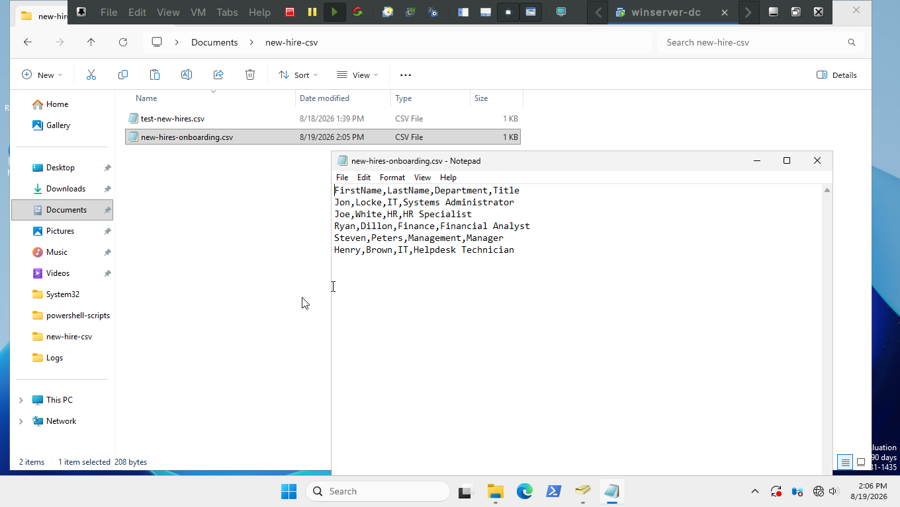
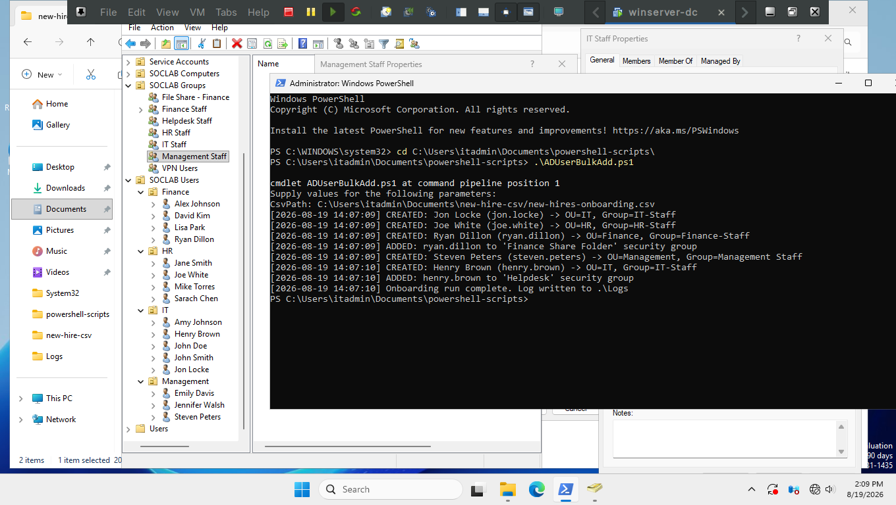
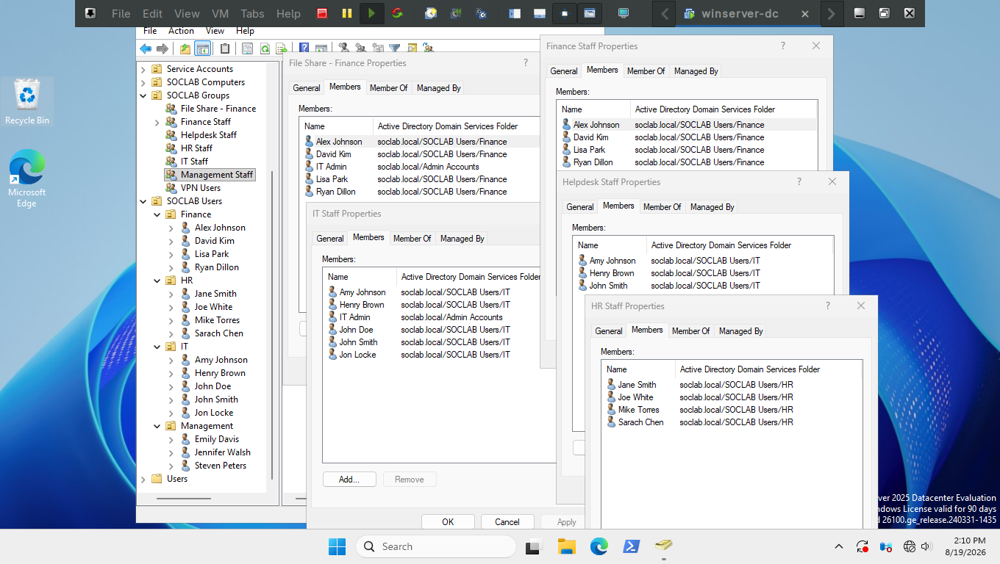

## Ticket 01 — Onboarding

**Description:** HR requests AD accounts be created for new hires starting Monday.

**Time constraint:** Mine - 5min | Realistically have until end of week (before Monday)

---

### Method 1: Scripted

Using `ADUserAdd.ps1`.

```powershell
.\ADUserAdd.ps1
```

*First I checked the contents of the CSV file and the path to the file*



*Then I ran the script and checked for the newly created users in their correct Department OU's*



*Finally I checked all the security group members to ensure they all got added to the correct groups*



---

### Method 2: Manual

You would go to each Department OU add create a new user and set a temp password for each new hire, then
add those new users to their respective security groups.

For 5 new hires it would take about ~15-20min


### Time Taken
Manually N/A (probably about 15-20min) | Script: 20 seconds to run about 2-3 min to verify eveything
