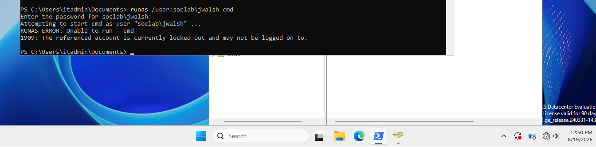
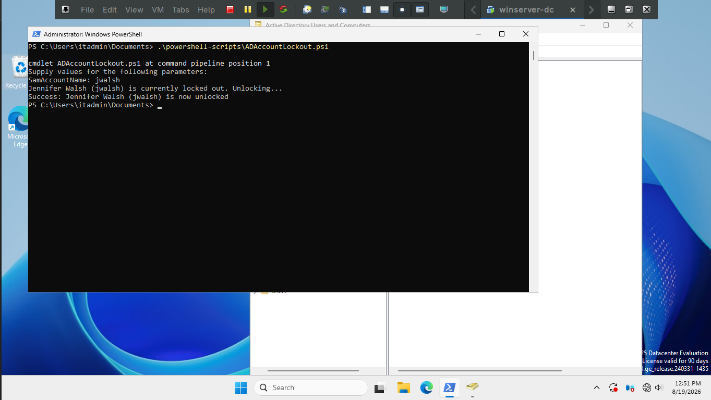
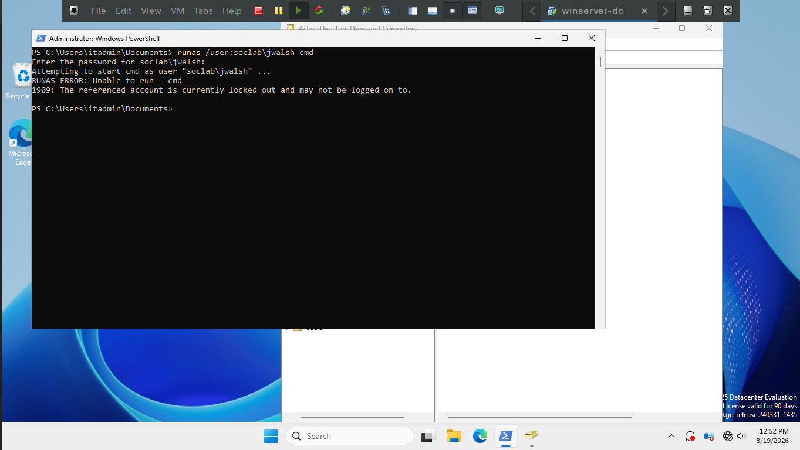
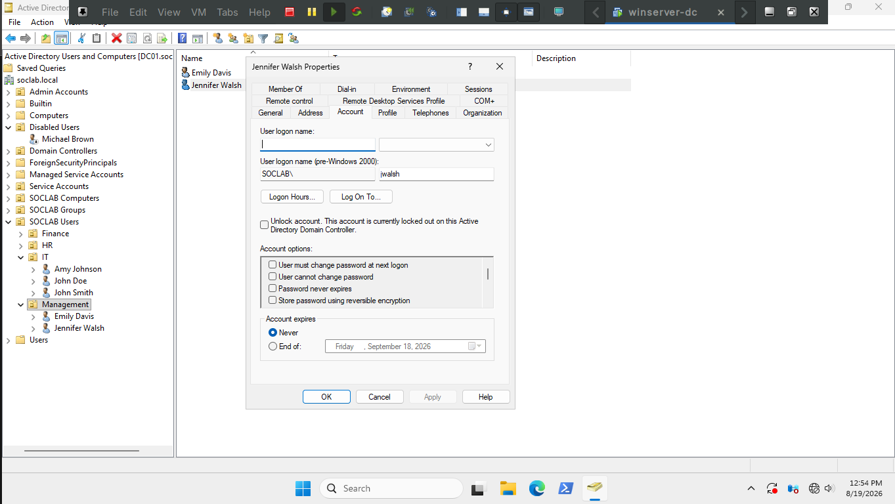
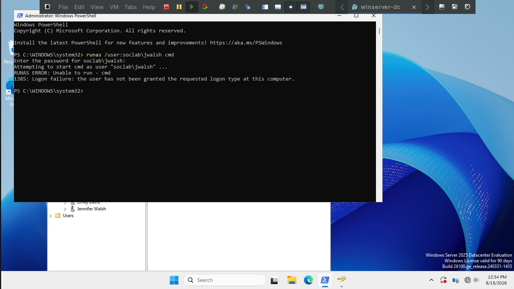

# ## Ticket 02 — Account Lockout

**Description:** "I keep typing my password right and it says my account is locked, I can't get into my computer."

**Affected User**: Jennifer Walsh

**Time constraint:** ~10min

### Method 1: Scripted

Using `ADAccountLockout.ps1`.

```powershell
.\ADAccountLockout.ps1 -SamAccountName "<username>"
```
*I first checked that account was locked out*



*Then I ran the script*



I will say I didn't double check that the account was unlocked - normally good hygiene to ensure but usually the 
script will throw errors if something actually went wrong.

### Method 2: Manual

*I then re-locked-out the account and checked if it was locked out*



*I then right-clicked jwalsh and press properies, went to the account tab, checked unlock account and pressed apply.*



*Finally I verified account is unlocked - this is what I should've done when I ran my script 
but in my defense I essentially did when I went to relockout the account*

*The error being thrown here is expected - the user needs to change their password at logon*



### Time Taken
Manually ~3min | Script ~20sec

The script saves a lot of time here since you don't need to click through multiple tabs its one command 
and then verify it worked with one more command.
