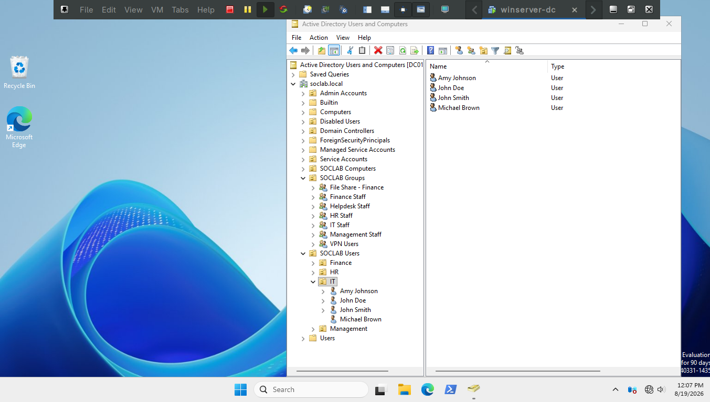
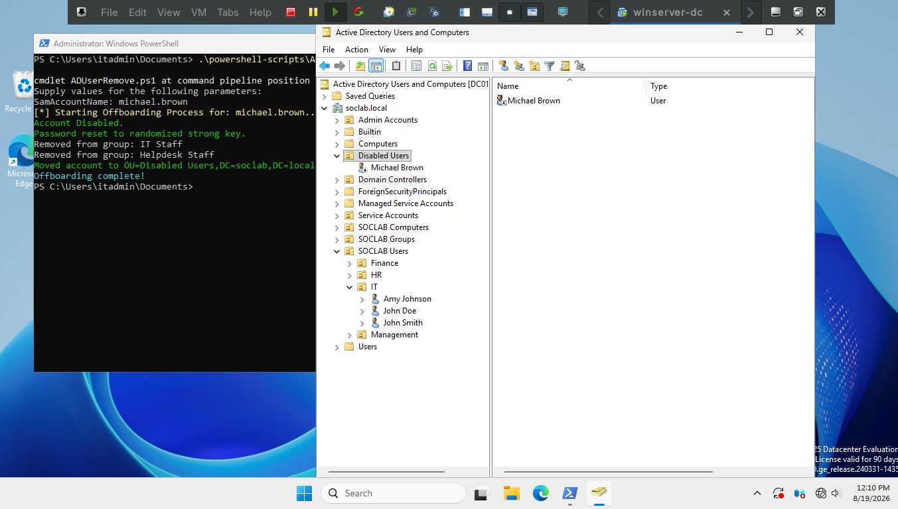
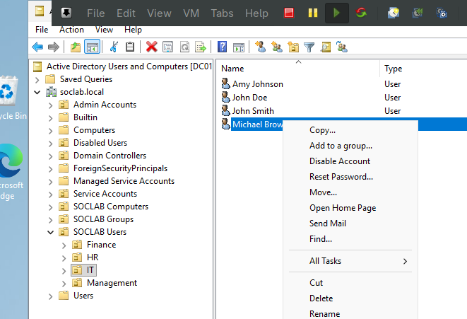
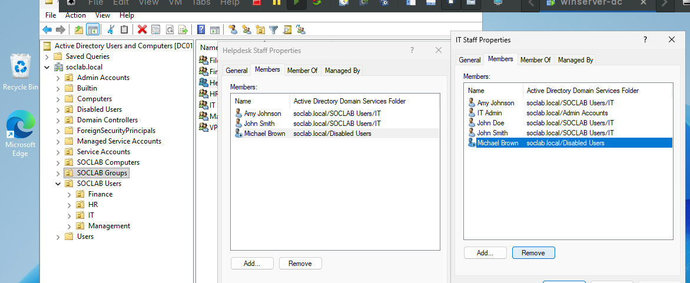
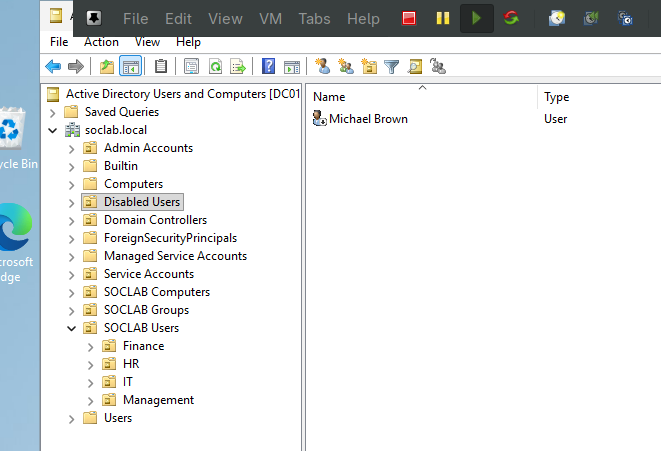

# Ticket #03 - Offboarding

**Description:** HR requests immediate offboarding of Michael Brown (IT) — termination effective today. Affected user: `michael.brown`.

**Time constraint:** 10min

---

### Method 1: Scripted

Using `ADUserOffboard.ps1`.

```powershell
.\ADUserOffboard.ps1 -SamAccountName "michael.brown"
```

*I checked that the user was there - normally wouldn't do this mostly just for proof for the script.*



*I then ran the script and refreshed Active Directory Users and Computers to ensure the script worked.*



This in all took about 1min max - spent more time booting up the VM.

---

### Method 2: Manual

Open Active Directory Users and Computers. Find the user, right click disable. Go to each group they are apart of and remove them. Then reset password, and move object to Disabled Users OU.

*Here I disable michael.brown's account and reset the password*



*Next I remove him from the two security groups he was apart of*



*I then move the object to the Disabled Users OU*


*Finally I verify the move took effect*



---

### Time Taken
~5min manually | ~1min using the script 

Most of the time was spent booting up the VM collecting screenshots and verifying, some of that wouldn't be necessary in a production environment. 

Overall my script would save ~3min which may seem minuscule but any time saved for these repetitive tasks is an improvement. Also this script allows for less mistakes made by human error.
