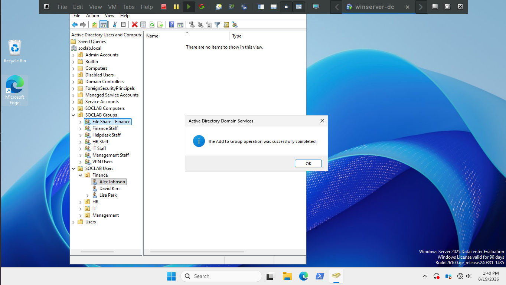
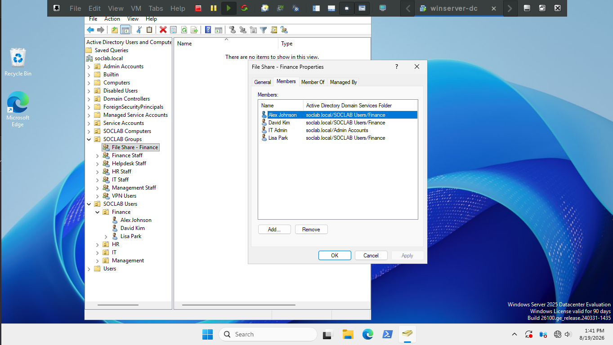

## Ticket 04 — File Access

**Description:** "I can't get into the finance shared drive, I need it for a report due today."

**Affected User:** Alex Johnson

**Time constraint:** 10min

### Method 1: Scripted

Not yet automated — worked manually below. Candidate for a future script (e.g. `ADUserGroupAdd.ps1`)._

### Method 2: Manual

*First I checked the members of each Finance security group and noticed 
Alex Johnson was in the Finance Security Group but not the File share one*

*Then I dragged the user object  over to the Finance File Share security group to add him.*

*Finally I checked the file share security group to ensure they were added.*

### Time Taken
Manually ~3min | Script: N/A

Automating this workflow would be very much worth it; could cut down the time is takes from 3-5min 
to about 30 seconds.
